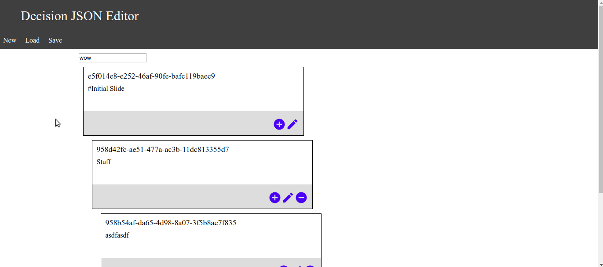

# decision_json_editor
A web editor for the decision trees used in the [decision_json_web](https://github.com/jfehrman/decision_json_web) project.

## Purpose
The purpose of this project is to provide an easy interface for creating decision trees to be used by the decision tree static site [decision_json_web](https://github.com/jfehrman/decision_json_web).  In this document we will go over the target audience for the editor, and how to use the editor.  In addition we will also provide useful links on contributing to this project as well as information about filing bugs.

## Target Audience
The decision_json_editor is designed to be user friendly enough for any user to participate.  Our goal is to make the creation of decision tree content easy so that it can be done by the subject matter experts that will use them.

## How to use
In this section we will go over how to use the decision_json_editor.  The easiest way to use the decision_json_editor is to go to the site [online editor](https://jfehrman.github.io/decision_json_editor/#/).
> *Note the online editor does **not** save any content externally.  All content resides on your local machine.*
In addition to using the online editor a user can also opt to host their own local version of decision_json_editor.  This will be covered in the [Setup](#Setup-(advanced)).

### Setup (advanced)
This section will go over how to install a local version of the decision_json_editor.

#### Requirements
decision_json_editor requires that node is installed to build the project.

#### Build
decision_json_editor is a static site.  This means that once the build process has been completed the website does not change.  To build the site run the following command:
```bash
npm run build
```
This will generate the JavaScript required to run the project under the /public/assets/ folder.

#### Server
This project has no requirement on a specific server.  Simply running the command `npm start` will start a small local development server running on port 8080.  We do not recommend you use this server for production and recommend you find a server that fits your needs the best.

Our recommendation is to go with [nginx](https://www.nginx.com/).  This is a very popular web server and should fill any need you will have for this project.  For setup on nginx please review their documentation.

### Editing state
Editing a state is done by clicking the pencil icon on the state that you wish to be edited.  Once on that screen a user can edit the content of the state.  The link input box is for putting the text you would like the user to see when selecting this state.  The slide markdown section is where the user can enter [Markdown content](https://github.com/adam-p/markdown-here/wiki/Markdown-Cheatsheet) to be displayed as the text of the state.


### Creating child state
To create a child state a user will click the add icon on the state that they wish to add the child state to.  The interface to edit an existing state is the exact same.  One thing you will note is that child states are slightly indented and directly below their parent.  This is a visual representation to the user that this state is a child state.  Each child state will be indented more than the previous.


### Removing state
Removing a state is done by clicking the minus sign on the state that you wish to remove.
*You should remove all child states from the state you wish to remove before removing the state.*


### Saving decision tree
To save a decision tree you can hit the save button on the navigation bar at the top of the application.  The application will save the file with the name which is specified on the main decision tree view at the very top.  By default this value is undefined.


### Loading existing decision tree
Loading a decision tree can be done by clicking the load button on the navigation bar at the top of the page.


### Creating new decision tree
Creating a new decision tree is done by clicking the new button on the navigation bar.



## Useful Links
This section will go over useful links for this project.

* [Contributing](CONTRIBUTING.md)

## Support
Please [open an issue](https://github.com/jfehrman/decision_json_editor/issues/new) for support.